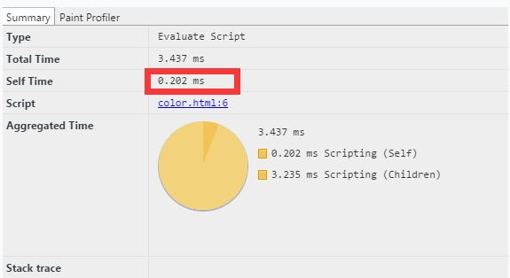
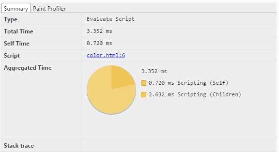

# 颜色生成器及效率对比

###### 公共函数

- DJB算法

```
function genHash (str){
    var hash = 5381;
    str = str || '';
    for(var i=0, len=str.length; i<len; ++i){
        hash += (hash << 5) + str.charAt(i).charCodeAt();
    }
    return hash & 0x7fffffff;
}
```
- 补齐或截取九位长度

```
function cut(num){
    return (genHash(num)+ "000000000").slice(0, 9);
}
```

###### 两种生成颜色方法

1. for循环

```
//创建RGB颜色
function createRGBColor(num){
    var uin = cut(num);var rgb = [];
    for(var i = 0 ; i < uin.length ; i+=3 ){
        var rgbnum = uin.substr(i,3) % 255;
        if(rgbnum < 64) rgbnum += 64;
        rgb.push(rgbnum);
    }
    return 'rgb(' + rgb.join(',') + ')';
}
```

*timeline录制耗时*




2. 正则替换

```
function createRGBColor(num){
    var colorString = "#" + (cut(num).replace(/(\d{3})/g, function($0) {
        var c = $0 % 255;
        if(c < 64) c += 64;
        return c.toString(16);
    }));
    return colorString;
}
```

*timeline录制耗时*




######大量计算测试（百万次）

```
//DJB算法
function genHash (str){
    var hash = 5381;str = str || '';
    for(var i=0, len=str.length; i<len; ++i){
        hash += (hash << 5) + str.charAt(i).charCodeAt();
    }
    return hash & 0x7fffffff;
}

//补齐或截取九位长度
function cut(num){
    return (genHash(num)+ "000000000").slice(0, 9);
}
// console.log(cut('35467684654'));

//创建rgb(96,145,215)颜色
function createRGBColor(num){
    var uin = cut(num);
    var rgb = [];
    for(var i = 0 ; i < uin.length ; i+=3 ){
        var rgbnum = uin.substr(i,3) % 255;
        if(rgbnum < 64) rgbnum += 64;
        rgb.push(rgbnum);
    }
    var ret = 'rgb(' + rgb.join(',') + ')'return ret;
}

//创建#12F5V2颜色
function createRGBColorReg(num){
    var colorString = "#" + (cut(num).replace(/(\d{3})/g, function($0) {
        var c = $0 % 255;
        if(c < 64) c += 64;
        return c.toString(16);
    }));
    return colorString;
}

var TIMES = 1000;
var data = [,,,,,,];

//省略，上千数据的数组
var startCreateRGBColorReg = function() {
    var ret = [];
    console.time("createRGBColorReg");
    for(var i = TIMES;i>0; i--) {
        data.forEach(function(appid){
            createRGBColorReg(appid);
        });
    }
    console.timeEnd("createRGBColorReg");
    return 1;
};

var startCreateRGBColor = function() {
    var ret = [];
    console.time("createRGBColor");
    for(var i = TIMES;i>0; i--) {
        data.forEach(function(appid){
            createRGBColor(appid);
        });
    }
    console.timeEnd("createRGBColor");
    return 1;
};

var init = function() {
    startCreateRGBColorReg();
    startCreateRGBColor();
};
init();
```

###### 测试数据


##### 测试证明：截断操作使用循环的效率快于正则